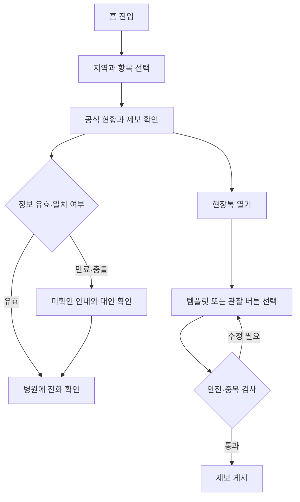
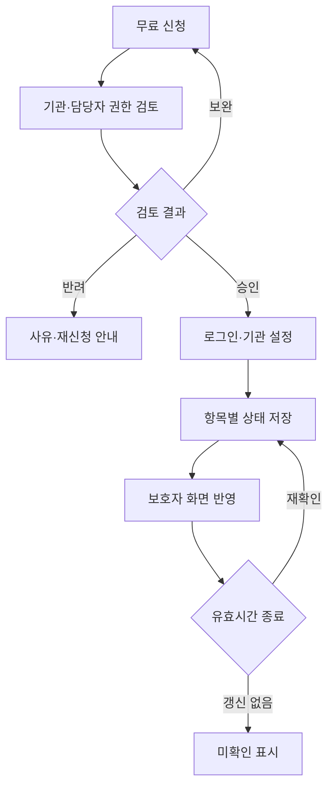
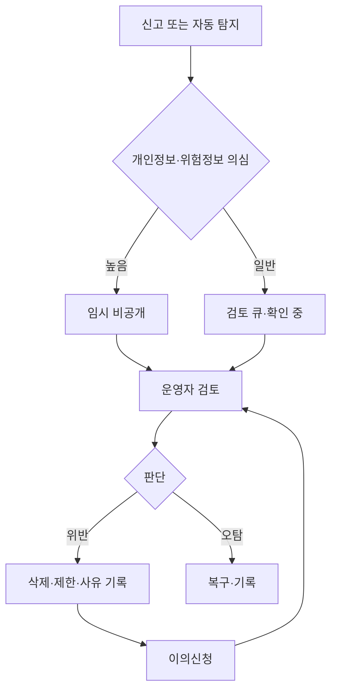

# CareTime 상세 기능 명세서 및 UX 플로우 v1.0

작성일: 2026-09-27 · 서비스: 케어타임 / https://caretime.kr · 대상: Claude Code 개발자, 대표, 운영 담당자

문서 상태: 구현 가능한 제안 기준안. 기존 코드·배포·DB는 열람하지 않았으므로 구현 완료를 뜻하지 않는다. 사용자는 Claude Code로 구현했고 Gemini에서 기획·개발 중이라고 밝혔다. 기존 구조를 조사하여 아래 계약을 맞추고, 재개발이나 DB 교체를 전제로 삼지 않는다.

## 0. 제품 결정과 검증할 가정

**제품 약속: “지금 확인할 병원의 접수 현황과 현장 제보를 한눈에 보고, 전화로 확인한다.”** 진료·수용 확약, 의료적 중증도 판정, 예약·배정이 아니다.

- 보호자의 긴급한 탐색을 돕되 ‘모든 외상은 1~2시간 이내’, ‘응급실은 KTAS 4~5를 거부한다’, ‘경쟁자가 없다’는 문구를 서비스·영업 자료의 확정 사실로 쓰지 않는다. 이는 의학적 기준이나 입증된 시장조사가 아니다. KTAS는 이용자가 자가 판정하도록 구현하지 않는다.
- 사용자 입력은 병원 탐색 필터다. 증상만으로 진료 적합성이나 치료·금식 시간을 계산하지 않는다. 수면봉합·연령 제한은 병원이 관리하는 조건과 전화 문의 항목으로 표시한다.
- 공식 현황과 현장 제보를 별도 표시한다. 투표나 인기 순위로 ‘진료 가능’을 만들어내지 않는다.
- 병원 상태는 시간 제한이 있는 정보다. 마지막 갱신 시각, 만료 시각, 서비스 항목, 대상 조건을 함께 보여준다.
- ‘무로그인’은 계정 가입이 없다는 뜻이다. 서버 세션과 악용 방지는 필요하며 완전 익명·추적 불가를 약속하지 않는다.
- ‘1초 완성’은 템플릿 선택 경험 목표다. 첫 작성 시 필요한 안전 안내와 동의를 생략하는 목표가 아니다.
- 법적 위험을 문구만으로 원천 제거할 수 없다. 출시와 유료화 전 실제 계약·화면·노출 로직에 대한 의료법 검토를 별도 게이트로 둔다.

### 범위와 출시 순서

| 단계 | 포함 | 기본 제외/후속 조건 |
|---|---|---|
| P0 비공개 파일럿 | 지역·카테고리 탐색, 공식 상태, 제한된 현장 템플릿/리액션, 전화·지도·공유, 병원 신청/승인/토글, 신고·운영 콘솔 | 결제, 개인 증상 공개, 사진·첨부, DM, AI 진단, 환자 자동 배정 |
| P0.1 공개 MVP | P0 + 짧은 운영현황 자유메모, 스팸·개인정보 차단, 접근성·운영 대응 검증 | 실시간 중재 인력이 없으면 자유메모는 기능 플래그 OFF |
| P1 SaaS | 직원 권한, 상태 변경 이력, 운영 리마인더, 교대 인계, 집계 통계, 월 구독 | 유료 순위·환자 건당 요금 없음 |
| P2 별도 검토 | 사용자가 직접 여는 관리용품 정보와 제휴 링크, 내원 예정 공유 | 민감정보/제3자 제공 검토와 상품별 광고·표시 검토 후 활성화 |

핵심 KPI: 병원 상세까지 걸린 시간, 전화 버튼 클릭률(실제 연결로 간주하지 않음), 공식 상태 유효 비율, 제보-공식 불일치율, 병원 토글 성공률, 신고 처리 시간. 진료 성공률은 별도 검증 없이는 산출하지 않는다.

## 1. 정보 구조와 공통 UI

| 경로 | 화면 | 접근 |
|---|---|---|
| / | 지역·카테고리·최신 병원 현황 | 비회원 |
| /hospitals/:id | 병원 연락처·항목별 공식 상태·현장 제보 | 비회원 |
| /chat?hospital=:id&category=laceration | 병원별 현장톡; 병원 미선택이면 지역 피드 | 읽기 공개, 작성 시 서버 세션 |
| /partner | 무료 참여 안내·신청 | 공개 |
| /partner/application/:token | 신청 진행 상태 | 인증된 신청자 전용 |
| /partner/login | 승인된 원무 담당자 로그인 | 인증 |
| /partner/dashboard | 상태 토글·대기·공지 | 병원 소속 권한 |
| /partner/team, /partner/billing | 직원 권한·구독 | 소유자만 |
| /admin/applications, /admin/reports | 승인·신고·감사 | 운영자, MFA |
| /guide, /guide/products | 안내·선택형 관리용품 | 커머스는 P2 플래그 |
| /policies/privacy, /policies/terms, /policies/community | 정책·버전·문의 | 공개 |

공통: 모바일 360px부터 지원, 터치 목표 44px 이상, 본문 16px 이상, 텍스트 대비 4.5:1 목표. 색과 아이콘만으로 상태를 구분하지 않는다. 전화 CTA는 하단 고정하되 작성창·키보드와 겹치지 않는다. 움직이는 티커는 자동 흐름 대신 정적 공지 + 펼치기; 스크린리더로 중복 낭독하지 않는다.

상단 안전 줄: “위급한 상황에서는 현장톡 답변을 기다리지 말고 119에 연락하세요.” 상세 응급 징후 콘텐츠는 의료 검토 후 버전 관리한다. 서비스가 안전하다고 판정하는 분기는 만들지 않는다.

## 2. 홈(/) 상세

### 2.1 첫 화면 순서

1. 로고, 지역 선택(시·구), [내 주변] 버튼. 위치 권한은 누를 때만 요청한다.
2. 위 안전 줄과 [119 전화].
3. [열상] [화상] [기타] 3분할. 초기 ‘열상’ 선택, 제목에 선택 상태를 명시한다.
4. “병원 공식 현황 / 보호자 현장 제보” 구분과 절대·상대 시각.
5. 병원 카드: 이름, 주소/거리, 선택 항목 공식 상태, 최근 제보 요약, [전화로 확인] [현장톡].
6. 하단 [현장 상황 남기기]. 병원 선택 후 작성창을 연다.

지역 미설정: “어느 지역을 찾으세요?”와 최근 선택·수동 검색을 표시한다. 임의 지역을 실제 현재 위치처럼 보여주지 않는다. 권한 거부 시 시·구 탐색이 동일하게 작동한다. 정확한 좌표는 기본 DB에 저장하지 않으며 요청 본문·분석 로그에서도 제외한다. 거리 계산 후 폐기; URL에는 지역 코드만 둔다.

### 2.2 병원 카드와 정렬

공식 상태 예: “병원 제공 · 열상 접수 가능 · 21:10 갱신 · 21:40까지 유효”. 이어 “소아 연령·봉합 방식은 전화 확인”. 제보 예: “보호자 제보 · 최근 15분 대기 3명 이하 2건”.

기본 정렬: 선택 지역·서비스 일치 → 유효 공식 접수 가능 → 정보 미확인 → 공식 마감. 같은 그룹은 거리, 좌표 없으면 병원명, 최종 hospital_id로 안정 정렬. 제보만으로 그룹을 올리지 않는다. 마감 병원도 숨기지 않고 이유와 다음 확인 필요를 표시한다. 정렬 설명을 공개하고 구독 등급은 정렬 계산에서 배제한다.

빈 상태: “이 지역에는 최근 확인된 정보가 없습니다.” [인접 지역 보기] [응급의료포털 안내] [119]. 정적 진료시간만 있으면 “운영시간 정보 · 현재 접수 미확인”.

통신 실패: 기존 데이터에 “연결 끊김 · 마지막 수신 21:10”; 만료 후 가능 배지 제거. 새로고침과 전화만 제공한다. 가짜 제보·시드 데이터는 운영 환경에 노출하지 않는다.

성능 목표: 국내 모바일 기준 p75 LCP 2.5초 이하, 캐시된 첫 상태 요약 1초 내 표시 목표. 수신 시각과 원자료 갱신 시각을 혼동하지 않는다. 목표 미달 시 이미지·지도보다 텍스트 상태를 우선 렌더링한다.

## 3. 현장톡(/chat): 가입 없는 상황 공유

### 3.1 세션 정책

- 읽기는 세션 없이 허용한다. 첫 작성 또는 리액션 시 POST /api/v1/guest-sessions.
- 서버에서 암호학적 난수로 256비트 토큰 발급; DB에는 토큰 해시만 저장. HttpOnly, Secure, SameSite=Lax 쿠키. 쓰기는 Origin 검사와 CSRF 토큰 검증을 함께 수행한다.
- 기본 유휴 24시간, 절대 7일 만료. 토큰 회전 시 guest 주체 ID는 유지하여 기존 제한을 우회하지 않도록 한다. 만료 후에는 새 별명이며 기존 글 수정 권한은 복구되지 않음을 안내한다. 삭제 요청 창구는 별도로 제공한다.
- 닉네임: 서버 허용목록 형용사 + 동물/자연명 + 무작위 4자리, 예 ‘차분한수달4821’. 의료인·병원·공식·관리자·실명을 암시하는 단어 금지. hospital_id + 날짜 + guest_id에 대한 서버 HMAC으로 방별 별칭을 파생해 병원 간 활동 연결을 줄인다. 별명은 인증 수단이 아니다.
- 클라이언트 제한: 글 전송 후 30초 버튼 비활성, “다시 작성까지 29초”; 리액션 2초 연타 방지. 실패 시 사용자 초안을 보존한다.
- 서버 제한: 글 30초당 1건·시간당 10건·일 30건/guest, 리액션 10초당 5회·시간당 60회/guest, 신고 시간당 5건. 중복 본문은 같은 병원에서 10분 이내 거절한다.
- IP 기반 보조 제한은 HMAC 처리된 짧은 수명 키로 사용; 병원 공용 Wi-Fi를 고려해 바로 영구 차단하지 않고 CAPTCHA/지연을 적용한다. 쿠키 삭제·프록시 우회로 완전한 1인 1표는 보장되지 않음을 전제로 둔다.
- 제한값은 서버 설정으로 버전 관리. 429 응답에 retry_after_seconds 제공. localStorage의 카운터는 보안 기준으로 사용하지 않는다.

### 3.2 작성 플로우와 데이터 최소화

[병원 선택] → [열상/화상/기타] → [관찰 제보 / 질문] → [템플릿 선택] → [필요 시 운영현황 메모 ≤120자] → [게시].

첫 작성 1회: “진료 현황만 공유해 주세요. 환자 이름·나이·연락처·얼굴·상처 사진·개인 증상은 올리지 마세요.” 정책 버전 동의. P0에서는 사진, 외부 링크, 전화번호, 개인 증상 템플릿 자체가 없다. 게시 요청은 body보다 template_id + 선택지 값을 우선 사용한다.

관찰 제보는 [방금 확인] [5분 전] [10분 전]을 선택; 서버가 observed_at 검증. ‘지금’ 선택이 관찰자 본인의 직접 확인인지 안내하며 GPS를 강요하지 않는다. 질문은 관찰 근거와 집계에서 제외한다.

개인 의료정보가 포함된 자유 입력은 서버에서 검출 시 게시를 막고 수정 요청; 검출이 완전하지 않으므로 신고·운영 삭제도 필요하다. 증상 필터를 이용자 ID와 결합한 이력으로 분석하지 않는다. 공개 환자 상담 기능이 필요해지면 별도 법적 근거·동의·아동 보호·수신자 권한부터 설계한다.

### 3.3 1초 템플릿 목록

표의 문구는 환자 상태가 아닌 해당 병원의 운영 현황이다. 병원명은 화면 컨텍스트로 붙이며 사용자 본문에 반복하지 않는다.

| 분류 | ID | 종류 | 입력창에 채워지는 문구 | 게시 전 조건 |
|---|---|---|---|---|
| 열상 | L01 | 관찰 | 방금 봉합 접수가 가능하다고 안내받았어요. | 확인 시각 |
| 열상 | L02 | 관찰 | 봉합 접수가 마감됐다고 안내받았어요. | 확인 시각 |
| 열상 | L03 | 관찰 | 봉합 접수 가능 여부는 전화 확인이 필요하다고 안내받았어요. | 확인 시각 |
| 열상 | L04 | 질문 | 지금 소아 봉합 접수 여부를 확인하신 분 있나요? | 질문 라벨 |
| 열상 | L05 | 질문 | 지금 봉합 접수 대기 상황을 확인하신 분 있나요? | 질문 라벨 |
| 화상 | B01 | 관찰 | 방금 화상 진료 접수가 가능하다고 안내받았어요. | 확인 시각 |
| 화상 | B02 | 관찰 | 화상 진료 접수가 마감됐다고 안내받았어요. | 확인 시각 |
| 화상 | B03 | 관찰 | 화상 진료 가능 여부는 전화 확인이 필요하다고 안내받았어요. | 확인 시각 |
| 화상 | B04 | 질문 | 지금 화상 진료 접수 여부를 확인하신 분 있나요? | 질문 라벨 |
| 화상 | B05 | 질문 | 화상 진료 접수 대기 상황을 확인하신 분 있나요? | 질문 라벨 |
| 기타 | O01 | 관찰 | 현재 접수 대기 3명 이하로 보였어요. | 사람 수 기준·시각 |
| 기타 | O02 | 관찰 | 의료진이 있다고 안내받았어요. 진료 항목은 전화 확인해 주세요. | 확인 시각 |
| 기타 | O03 | 관찰 | 현재 접수가 마감됐다고 안내받았어요. | 확인 시각 |
| 기타 | O04 | 관찰 | 안내받은 예상 대기 시간은 [30분 이내/30~60분/60분 이상]예요. | 선택지 필수 |
| 기타 | O05 | 질문 | 지금 접수 상황을 확인하신 분 있나요? | 질문 라벨 |

템플릿 선택은 내용을 채울 뿐 자동 게시하지 않는다. 선택값 없이 대괄호가 남으면 게시 불가. 건강 결과·흉터·의료진 실력·친절도 평점은 현장톡에서 수집하지 않는다. 문의에 답이 없더라도 전화 CTA는 항상 유지한다.

### 3.4 퀵 리액션: 좋아요가 아니라 시점이 있는 제보

리액션은 게시글별 공감이 아닌 **병원×카테고리×현재 시점 관찰**에 달린다. 표시는 “최근 15분 제보 건수”이며 대기 인원 수로 읽히지 않게 한다.

| 버튼 | 의미 | 내부 metric/value | 유효기간 |
|---|---|---|---|
| 대기 3명 이하 👍 | 이용자가 관찰한 대기 규모 | queue/LE3 | 15분 |
| 의사 계심 🩺 | 의료진이 있다고 안내받음; 해당 시술 가능 확정 아님 | staff/PRESENT_REPORTED | 15분 |
| 접수 마감 ⚠️ | 해당 항목 접수 마감 안내를 받음 | reception/CLOSED_REPORTED | 15분 |

첫 누름 전 인라인 설명 “직접 확인한 상황만 눌러주세요”; 이후 원터치. 활성 상태 재누름은 취소. 동일 guest/hospital/category/metric은 활성 기록 1개; 값 교체는 원자적 처리. queue·staff·reception은 서로 다른 사실이므로 동시 선택 가능. 15분 지나면 자동 집계 제외, 재확인은 사용자가 다시 눌러야 한다.

낙관적 +1 및 선택 테두리 → 서버 응답 counts와 version으로 교체 → 실패 시 원복 및 “반영되지 않았어요”. 해제는 -1, 0 아래 금지. 숫자 변경은 aria-live=polite, 동시 이벤트는 500ms 묶어 낭독. 재접속 때 전체 집계를 다시 받고 오래된 이벤트는 무시한다.

공식 가능 + 최근 마감 제보가 공존하면 양쪽을 모두 노출하고 “정보가 서로 달라요. 전화 확인이 필요합니다.” 배너. 공식 가능을 자동 마감으로 바꾸거나 다수결로 충돌을 지우지 않는다. 반대 경우도 같다.

### 3.5 피드 동작

최근순 cursor pagination 20건. 공식 상태는 상단 고정 영역, 일반 제보 목록과 다른 컴포넌트. 위로 스크롤 중 새 글이 오면 “새 제보 3건” 버튼만 표시하고 스크롤을 강제로 움직이지 않는다. 글에는 관찰/질문, 관찰 시각, 작성 시각, 만료 여부, 신고 메뉴를 표시한다.

관찰 제보의 ‘현재 참고’ 유효시간은 30분; 이후 “지난 제보”로 낮춰 표시하고 현재 요약 집계에서 제외. 공개 피드는 24시간, 이후 비공개 처리한다. 서버 조회에서도 동일 정책 적용. 시간 경과는 클라이언트 타이머만 믿지 않는다.

## 4. 공유 UX와 OG

- [카카오톡 공유]는 공식 공유 SDK의 템플릿으로 전달; 앱/도메인 등록과 키 설정 완료 후 활성화. 미설정·실패 시 OS 공유 또는 링크 복사.
- [맘카페에 공유]는 “문구+링크 복사” 후 이용자가 카페 편집창에 붙여넣기. 외부 카페에 원클릭 자동 게시된다고 표시하지 않는다.
- 공유 URL: /hospitals/:id?category=laceration. 세션, 개인 글, 위치 좌표, 환자 정보가 들어가지 않는다. 공유 대상 페이지의 canonical은 병원 상세 URL.
- OG는 서버 렌더링; og:title, og:description, og:image, og:url, og:type=website, og:site_name, og:locale=ko_KR, twitter:card=summary_large_image. 이미지 1200×630, 병원명 길이 제한·줄바꿈 처리.
- SNS OG 캐시는 즉시 갱신되지 않을 수 있으므로 이미지에 ‘현재 접수 가능’을 박제하지 않는다. 기본 카드: ‘OO병원 접수 현황 확인 · 열상/화상 · 방문 전 전화 확인’. 카드에는 환자 글·별명 없음.

공유 문구:
“[케어타임] OO병원 열상·봉합 접수 현황\n병원 제공 정보와 현장 제보를 확인할 수 있어요.\n접수 상황은 바뀔 수 있으니 출발 전 병원에 전화해 주세요.\nhttps://caretime.kr/hospitals/{id}?category=laceration”

정확한 상태를 공유 본문에 포함하는 후속 기능은 반드시 ‘2026-09-27 21:10 기준’과 비보장 고지 포함. 공유 횟수는 버튼 이용으로 측정하며 실제 게시·유입 성공과 구분한다.

## 5. 의료기관 참여(/partner)

### 5.1 신청 화면 및 수집

헤드라인: “병원 접수 현황을 직접 알려주세요.” 설명: “기본 현황 게시 무료. 환자 유입 건당 비용 없음.” 무료 정책이 유지되는 범위와 유료 부가기능을 약관에 명시한다.

| 필드 | 필수 | 검증·목적 |
|---|---|---|
| 의료기관명·주소·대표전화 | O | 기존 DB 검색 선택; 없으면 신규 신청, 중복 후보 표시 |
| 기관 식별자 | O | 공적 기관 식별번호 등 가능한 식별자; 원문 공개하지 않음 |
| 담당자명·역할 | O | 기관 관리 권한 확인; 개인 신상 공개 금지 |
| 담당 업무 이메일 또는 휴대전화 | O, 하나 | 코드 인증·승인 연락; 마케팅 동의 별도 |
| 진료 현황 관리 대상 | O | 열상/화상/기타 중 복수 선택; 자동 진료 가능 처리 금지 |
| 기관 권한 증빙 | O | 최소한의 문서/대표전화 확인; 주민번호·환자정보 가림 안내 |
| 개인정보 고지·이용약관 동의 | O | 버전·시각 기록 |
| 마케팅 수신 동의 | 선택 | 기본 미선택, 미동의로 신청 제한 금지 |
| 야간 시간·소아 제한·홈페이지 | 선택 | 초기에는 미확인; 승인 후 입력 가능 |

파일은 private 저장소, PDF/JPG/PNG ≤10MB, 실제 MIME 검사·악성파일 검사·격리, 5분 만료 서명 URL로 운영자에게만 제공. 공개 버킷 금지. 수집 필요성이 없는 신분증 전체 사본은 요구하지 않는다.

신청 상태: DRAFT → SUBMITTED → UNDER_REVIEW → NEEDS_INFO 또는 APPROVED/REJECTED. 신청 완료 페이지는 접수번호·‘심사 중’·문의·예상 안내 시점을 보여준다. 운영 가능 시간에 맞춰 응답 목표를 설정하고 승인 전 공식 배지/토글 권한을 주지 않는다.

기관 확인은 신청자가 적은 번호만 믿지 않고 공적 출처로 확인한 대표전화와 권한 증빙을 교차 확인한다. 기존 hospital의 소유권 중복 신청은 기존 소유자 검증/운영 검토 큐로 보내며 덮어쓰지 않는다.

### 5.2 승인 이후

승인 알림 → 일회용 초대 수락 → 계정 인증 → 기관 역할 OWNER 부여 → 기관 정보 확인 → 첫 상태 ‘미확인’ → 직원이 항목별 상태 직접 게시 → 보호자 화면 미리보기.

역할: OWNER(직원·결제 관리), EDITOR(상태·공지), VIEWER(읽기). 플랫폼 ADMIN과 병원 OWNER는 분리한다. 권한 회수는 다음 요청부터 적용, 기존 실시간 구독도 종료. 관리자 세션 12시간 절대·30분 유휴; 결제/직원 관리와 소유권 변경은 재인증. MFA는 OWNER/플랫폼 ADMIN 필수, 직원에는 권장.

## 6. 원무 현황 토글

### 6.1 5초 동작

대시보드 상단: 기관명·소속·마지막 저장·공개 상태. 큰 [열상 봉합] [화상 진료] 항목 카드. 각 카드에 [접수 가능] [마감] 버튼과 현재 만료 시각.

‘가능’ 누름 → 유효시간 기본 30분, [15/30/60분] 선택 가능 → 저장 → “21:40까지 접수 가능으로 게시했어요”. 초기 설정 뒤에는 기존 만료 정책으로 원터치 저장. ‘마감’은 즉시 반영 + 5초 되돌리기(별도 이력으로 기록); 로컬에서만 성공 표시 금지. 대기 시간 [미확인/30분 이내/30~60분/60분 이상]. 숫자를 임의 정확한 분으로 변환하지 않는다.

소아 가능 연령·수면봉합·전문의 여부는 별도 기관 제공 프로필. 현재 의료진 구성과 다를 수 있음을 표시하고 확인 갱신일을 둔다. 금식시간은 앱이 처방하지 않는다. “수면봉합 조건은 병원에 직접 확인하세요.”

### 6.2 상태 머신과 만료

DB status는 AVAILABLE/CLOSED/PAUSED/UNKNOWN. 화면 EXPIRED는 now >= valid_until로 파생한다.
- UNKNOWN/EXPIRED → 직원 입력 → AVAILABLE 또는 CLOSED.
- AVAILABLE → 마감/일시중단 → CLOSED/PAUSED.
- AVAILABLE/PAUSED는 기본 30분, 최대 60분 유효. CLOSED는 현재 근무 종료까지, 최대 12시간. 모든 상태는 만료 후 UNKNOWN으로 렌더링한다.
- 재개 예정 시각은 안내일 뿐 자동 AVAILABLE로 바뀌지 않는다.
- ‘전체 항목 마감’은 확인 1회 후 트랜잭션으로 적용; 성공한 항목만 부분 성공처럼 보이지 않게 한다.
- 만료 5분 전 대시보드 안내, P1 외부 알림은 수신 설정에 따름. 알림 실패해도 만료 로직은 작동한다.
- 동시 편집은 version 기반 compare-and-swap. 충돌 409이면 최신 상태·변경자 표시 후 다시 선택. 다른 직원 변경을 조용히 덮어쓰지 않는다.

### 6.3 공지와 배지

공지 ≤80자, 유효시간 ≤12시간, 기본 근무 종료. 허용: “오늘 화상 접수 22시 마감”, “현재 대기 약 60분 이상”. 금지: 가격 할인, 진료 효과 보장, 타 병원 비교, 환자 정보, 외부 광고 링크. 저장 시 서버 정책 검사, 위반이면 구체적 수정 안내.

공식 영역: 짙은 청색 아이콘 + “병원 확인 계정 · 기관 제공”; 제보 영역: 회색 말풍선 + “보호자 제보 · 미검증”. 툴팁: “케어타임이 기관 관리 권한을 확인한 계정입니다. 진료 품질이나 현재 수용을 인증하는 표시는 아닙니다.” 정부 인증·우수병원·진료 보장처럼 보이는 문양 금지. 결제 여부로 배지를 부여/제거하지 않는다.

## 7. 법률·안전·신고 정책

### 7.1 설계 기준

의료법 제27조 제3항은 영리 목적 환자 소개·알선·유인을 제한한다[S1]. 고정 월 구독이라고 자동 적법해지는 것은 아니다. 실제 환자 연결 구조, 광고, 계약, 과금이 함께 검토되어야 한다.

- 병원 전화·지도 링크는 이용자가 직접 선택. 자동 배정, 접수 보장, 건당 환자 리드 판매 없음.
- 할인쿠폰·진료비 환급·친구 환자 소개 보상·제보 대가로 진료혜택 없음.
- 순위는 공개된 객관 규칙이며 결제 등급·전환 수수료로 가중하지 않음.
- 유료 기능은 내부 업무 효율 도구. ‘돈을 내면 환자 더 보내드림’ 영업 문구 금지.
- 기관 소개·배지·공지·후기 등이 의료광고에 해당하는지와 심의 필요 여부는 의료법 제56조 등과 실제 노출 방식으로 검토[S2]. ‘정보 제공’이라고 이름 붙이는 것만으로 예외를 주장하지 않음.
- 건강정보 처리에는 개인정보 보호법 제23조의 법적 요건과 안전조치를 검토[S3]. 필요한 동의를 받는 경우 만 14세 미만 아동의 법정대리인 동의·확인 요건도 검토[S4]. 별명 게시도 재식별 가능성이 있어 무조건 익명정보로 보지 않는다.
- precise 위치 저장, 해외 클라우드, 처리위탁·국외이전·제3자 제공은 실제 도입 사업자/리전/흐름을 정한 뒤 검토한다. 기술 선택만으로 적법성을 단정하지 않는다.

### 7.2 고지 배치와 카피

| 위치 | 문구 |
|---|---|
| 홈/상세 공식 상태 아래 | “병원이 입력한 시점의 정보입니다. 실제 접수·진료 가능 여부는 방문 전 전화로 확인해 주세요.” |
| 현장톡 상단 고정 | “보호자의 현장 제보로, 병원의 공식 안내가 아닙니다. 상황이 바뀔 수 있으니 출발 전 전화로 확인해 주세요.” |
| 작성창 | “병원 운영 상황만 작성해 주세요. 환자·의료진의 개인정보, 개인 증상, 상처 사진은 올리지 마세요.” |
| 전화 CTA 인접 | “이 버튼은 병원 전화 연결을 위한 기능이며 예약이나 접수 확정이 아닙니다.” |
| 기관 배지 설명 | “기관 관리 권한 확인 표시입니다. 진료 품질·수용 가능 보증이 아닙니다.” |
| 참여 안내 | “참여 기관은 현황을 자발적으로 공유합니다. 실제 현장 상황은 달라질 수 있으니 서로 배려해 주세요.” |

‘어떠한 책임도 지지 않습니다’라는 포괄 면책을 안전장치로 삼지 않는다. 오정보 신고·정정·만료·모니터링을 실제 제공한다.

### 7.3 신고와 블라인드

신고 사유: 개인정보 노출 / 직접 확인하지 않은 허위 현황 의심 / 비방·욕설 / 광고·스팸 / 위험한 의료 조언 / 기타. 글·리액션·공지는 각각 대상 ID를 가진다. 신고 설명 200자 이하이며 불필요한 환자정보를 쓰지 않도록 안내.

- 같은 guest의 같은 대상 신고는 1건, 중복 200 idempotent 응답. 신고자의 식별정보는 병원에 제공하지 않는다.
- 명백한 개인정보·위험한 조언 패턴 탐지: 즉시 QUARANTINED, 공개 노출 차단, 운영 검토 큐. 탐지 오류는 이의신청으로 복구 가능.
- 단순 신고 수만으로 허위 확정·영구삭제 금지. 독립 세션 3건/10분은 우선 검토와 ‘확인 중’ 표시에 사용; IP·패턴 상관관계를 고려하되 개인 신원으로 단정하지 않음.
- 공식 가능과 마감 제보 충돌은 우선 운영 알림·전화확인 유도 대상. 병원 요청만으로 불리한 제보를 자동 삭제하지 않는다.
- 상태: VISIBLE → FLAGGED → QUARANTINED → RESTORED 또는 REMOVED. 조치 사유·운영자·시각·근거 코드를 비공개 audit에 기록.
- 글 작성자는 세션 소유 확인 후 삭제·이의신청 가능. 세션 분실자는 문의 경로로 최소한의 소유 확인을 진행한다.
- 운영 목표: 개인정보 노출/위험 조언은 자동 격리 즉시, 운영 시간 내 30분 검토; 일반 신고는 운영 시간 내 24시간. 이는 제안 SLA이며 실제 인력 배치가 선행해야 한다. 24시간 대응을 확보하지 못하면 야간 자유메모 OFF, 구조화 제보만 운영한다.

### 7.4 보관·삭제 제안값

| 데이터 | 제안 보관 | 삭제 방식/예외 |
|---|---|---|
| 일반 현장 글 | 공개 24시간, 서버 7일 | 이후 본문·세션 연결 삭제 |
| 리액션 | 집계 15분, 원본 24시간 | 이후 비식별 일 단위 집계만 |
| 비회원 세션 | 절대 7일 | 만료 후 24시간 내 토큰/별칭 제거 |
| 악용 방지 HMAC 키 | 24시간 | 키 회전과 원본 폐기, 영구 지문 금지 |
| 신고·조치 증거 | 사건 종료 후 30일 | 필요부분만 격리; 법적 보존 필요 시 근거·범위·기한 기록 |
| 기관 인증 첨부 | 승인/반려 후 30일 | 문서 삭제, 확인 결과만 유지 |
| 상태·권한 감사 로그 | 90일 | 접근제한; 환자 본문 금지 |
| 결제·계약 기록 | 별도 법정 보관표 | 결제 도입 전에 확정; 일괄 7일 삭제에 포함하지 않음 |

위 수치는 법정 기간이 아닌 운영 제안. 개인정보처리방침·위탁 계약과 함께 확정. 백업 최대 잔존 30일 목표, 복원 시 삭제 원장을 재적용하며 삭제가 완료된 데이터가 되살아나지 않게 한다. 보안/호스팅 로그 실제 보관 설정도 일치시킨다.

## 8. BM 및 병원 전환 시나리오

### 8.1 가격 가설과 기능 차이

월 99,000원/199,000원은 검증할 가격 가설이며 아래는 VAT 별도 기준안(실결제 108,900원/218,900원). 결제 도입 전 계약·가격 표시 확정.

| 등급 | 제공 기능 | 제외 |
|---|---|---|
| 무료 기본 | 기관 인증, 기본 상태·대기·공지, 1관리자, 기본 현장 피드 | 안전 관련 정보 게시를 유료로 잠그지 않음 |
| 운영형 99,000원 | 직원 5계정, 교대 인계, 운영 이력 조회, 갱신 리마인더, 주간 운영 집계 | 노출 우대·환자 개인정보 판매 없음 |
| 팀형 199,000원 | 직원 20계정, 세분화 권한, 다부서 상태, 감사 내보내기, 운영지원 | 기본은 기관 1곳; 다지점은 별도 검증 |

사용자에게 필요한 기본 상태와 만료 기능은 구독 취소 후에도 유지. 초과 직원은 OWNER가 선택해 VIEWER로 변경하도록 유예 7일; 접근 권한이 불명확하게 유지되지 않도록 만료 후 서버 강제 적용.

### 8.2 온보딩·유료 전환

D0: 무료 승인 → 기관 상태 1건 게시 → 보호자 화면 확인.
D3: “3일간 상태 갱신 8회, 만료 상태 노출 2회”처럼 실제 측정 운영지표 안내. 유입/매출 증가를 추정해서 만들지 않음.
D7: 직원 교대·갱신 누락 문제를 인터뷰. 필요 병원에 운영형 14일 체험 제안, 카드 등록 없이 시작.
D14~21: 직원 사용·갱신 누락·원무 업무시간 설문으로 가치 확인. ‘전화 감소’는 측정 없으면 주장하지 않음.
체험 종료 전: 기능 비교·VAT 포함 실결제·갱신일·해지·환불조건 명확 표시 → OWNER의 명시적 유료 신청 → 결제 성공 webhook 검증 후 활성화.

P0에서는 결제 버튼 대신 “운영 도구 관심 등록”. P1 전환 게이트 제안: 검증 기관 10곳 이상, 4주 주간 활성기관 60% 이상, 유료 의향 인터뷰 5곳 이상, 위험 신고 운영체계 작동. 수치는 목표 가설이며 시장 성과를 뜻하지 않는다.

구독 상태: FREE → TRIAL → ACTIVE → PAST_DUE → GRACE(7일) → FREE, CANCEL_AT_PERIOD_END → FREE. 결제 실패가 접수 상태를 ‘마감’으로 바꾸면 안 된다. 환불·취소·청구 내역 조회 구현, PG webhook signature 및 event_id 중복 방지 필수. 카드번호는 자체 저장하지 않는다.

### 8.3 관리용품 제휴 커머스(P2)

급한 병원 탐색·전화·현장톡·119 주변에는 상품 CTA를 넣지 않는다. /guide에서 사용자가 [진료 후 관리용품 정보]를 직접 선택 → “사용 시점과 방법은 진료받은 의료진에게 확인하세요” → 일반 정보 → [판매처 보기].

스테리스트립류, 실리콘 겔, 화상용 폼은 상품명만으로 의료기기/화장품 등 법적 분류나 허용 효능을 결정하지 않는다. 개별 SKU의 허가·신고·표시·광고 및 판매 자격을 검토하고 검증된 품목만 등록한다. 봉합 대체·흉터 제거 보장·자가 화상치료 지시 금지.

제휴 링크 바로 옆 “광고·제휴 링크: 구매 시 케어타임이 수수료를 받을 수 있습니다.” 표시. 검색 증상·글·병원·세션을 판매처 URL 파라미터에 넣지 않는다. 건강정보 기반 개인화·리타게팅 금지. 일반 카테고리별 정보만 제공하며 구매와 병원 노출을 연동하지 않는다. 상품 정보 최신성·판매처 책임·소비자 문의 경로를 갖춘 뒤 활성화.

## 9. 기술 구조와 데이터 요구사항

기존 repo의 AGENTS.md/CLAUDE.md, 프레임워크, Auth, DB, 배포, 지도 설정을 먼저 확인하고 재사용한다. 신규 백엔드가 필요하다면 병원 계정·기관별 권한·실시간 상태·비공개 파일 때문에 Supabase형 통합 구조를 검토할 수 있다. 이는 교체 지시가 아니며 리전·국외이전·비용 확인이 선행한다. 단순 Turso 저장소만 도입할 경우 Auth·권한·이벤트·파일보관을 별도 구현해야 하므로 총 작업량으로 판단한다.

논리 구조: Web → 서버 API(인증·검증·제한) → 관계형 DB → outbox → 공개 상태 이벤트. 보호자에게 DB 테이블 원본을 구독시키지 않는다. 공개 DTO만 SSE/Realtime 채널로 내보내며 직원/증빙/신고 채널은 분리한다. 비밀키·서비스 역할 키는 서버 전용.

### 9.1 테이블 계약

모든 시각은 UTC timestamptz, UI Asia/Seoul. ID UUID, 문자열 enum은 DB CHECK/enum, 외래키와 필수 NOT NULL 적용. 아래 ?는 nullable. 삭제/보관은 7.4에 따른 작업으로 처리.

| 테이블 | 핵심 필드 | 제약·인덱스 |
|---|---|---|
| hospitals | id, registry_key?, name, address, region_code, phone, lat?, lng?, verification_state, verified_at?, created_at | registry_key unique when present; region_code; 기관 운영 정보만 공개 |
| hospital_services | id, hospital_id, category, service_code, reported_age_min?, reported_age_max?, capability_note?, profile_verified_at? | unique(hospital_id,service_code); age_min<=age_max; capability는 현재 수용 여부 아님 |
| partner_applications | id, hospital_id?, applicant_user_id, institution_fields_json, contact_encrypted, state, evidence_path?, submitted_at, reviewed_at?, reviewer_id? | 신청자/운영자만; 연락처·증빙 공개 금지 |
| users | id, auth_subject, created_at, disabled_at? | auth_subject unique; 인증 제공자와 매핑 |
| hospital_memberships | hospital_id, user_id, role, revoked_at? | unique(hospital_id,user_id), 서버에서 매 요청 소속 확인 |
| service_statuses | hospital_id, service_id, status, wait_bucket, reason_code?, reopen_at?, valid_until, updated_by, updated_at, version | unique(hospital_id,service_id); service FK가 같은 병원인지 composite FK 검증 |
| status_events | id, hospital_id, service_id, actor_user_id, old_json, new_json, version, created_at | append-only; hospital/time index; 운영 감사 전용 |
| notices | id, hospital_id, text, valid_until, moderation_state, created_by, created_at, version | 80자, 공지 노출 조건은 승인+미만료 |
| guest_sessions | id, token_hash, created_at, last_seen_at, expires_at, revoked_at?, policy_version? | hash unique; 브라우저에 원본 id·hash 공개 금지 |
| posts | id, hospital_id, category, guest_id, room_alias, kind, template_id, template_payload, body?, observed_at?, created_at, valid_until?, visibility, public_until, purge_at, version | hospital/category/created_at/id cursor index; body 120자; observation만 observed_at 필수 |
| observations | id, hospital_id, category, guest_id, metric, value, observed_at, expires_at, active, version | 활성 unique(hospital_id,category,guest_id,metric); expires_at index |
| reports | id, target_type, target_id, reporter_guest_id?, reporter_user_id?, reason, detail?, state, created_at | reporter 중 하나만; 대상 유형별 FK 검증; 대상+reporter unique |
| moderation_actions | id, report_id?, target_type, target_id, action, reason_code, actor_id, created_at | append-only; 공개 API 금지 |
| consent_events | id, actor_type, actor_id, purpose, policy_version, accepted, created_at | 목적별 분리; 민감정보 기능 추가 시 별도 동의 계약 필요 |
| subscriptions | hospital_id, plan, state, provider_customer_id?, current_period_end?, cancel_at_period_end | unique hospital; OWNER만 읽기/쓰기; P1 |
| billing_events | id, provider_event_id, event_type, processed_at | provider_event_id unique; P1 |
| outbox_events | id, aggregate_key, aggregate_version, event_type, public_payload, created_at, published_at? | DB 트랜잭션과 함께 작성; 재전송 가능 |
| idempotency_keys | actor_key, key, request_hash, response_status, response_json, expires_at | unique(actor_key,key), 24시간 |
| product_links | id, category, sku, legal_category, review_state, disclosure, destination_url, verified_at | P2; 승인·미만료 품목만 공개 |

일반 users와 guest_sessions는 자동 병합하지 않는다. 공개 DTO에 guest_id, actor_user_id, contact, evidence_path, token_hash, 원 IP 포함 금지. 운영자라도 최소 필요 권한과 감사 로그 적용.

### 9.2 상태 파생 규칙

```text
if institution verification != APPROVED: official status = UNVERIFIED
else if now >= valid_until: official status = UNKNOWN(reason=EXPIRED)
else: official status = stored status
observation count = COUNT(active && expires_at > now && not quarantined)
conflict = valid official AVAILABLE + recent CLOSED_REPORTED
        OR valid official CLOSED + recent eligible acceptance observation
```

만료 배치가 늦어도 모든 read/API/공개 DTO 생성에서 같은 함수를 호출한다. 브라우저에서도 server_time 기준 타이머로 expired 처리한다. CDN 공개 현황 캐시 최대 15초이고 잔여 유효기간을 넘기지 않는다. 만료 상태를 stale-while-revalidate로 ‘가능’으로 재사용하지 않는다. 개인정보 응답은 no-store.

## 10. API 계약

공통 응답 `{data, meta:{server_time, request_id}}`; 오류 `{error:{code,message,field_errors?,retry_after_seconds?},request_id}`. 인증 쿠키, 모든 쓰기에 CSRF/Origin·스키마 검증. 리소스 ID만 바꿔 타기관에 쓰는 요청은 403/404.

| 메서드/경로 | 요청 요약 | 결과·권한 |
|---|---|---|
| POST /api/v1/guest-sessions | 정책 버전, CSRF bootstrap | 201 쿠키·별칭 컨텍스트; 읽기만 할 때 불필요 |
| GET /api/v1/hospitals | region,category,cursor,limit<=20; 좌표는 별도 비로그 요청 | 공개 카드 DTO, 유효 상태·전화 |
| GET /api/v1/hospitals/:id | category | 기관 상세·공식 출처·제보 집계 |
| GET /api/v1/posts | hospital_id,category,cursor | 노출 가능한 글만, 20건 |
| POST /api/v1/posts | hospital_id,category,kind,template_id,payload,body?,observed_offset | 201 또는 422/429; guest; Idempotency-Key |
| DELETE /api/v1/posts/:id | 없음 | 204; 작성 세션/운영자; 소유 검증 |
| PUT /api/v1/hospitals/:id/observations/:metric | category,value,active,observed_offset | 정규화 집계·selected·version; guest; toggle가 아닌 원하는 상태 전달 |
| POST /api/v1/reports | target_type,target_id,reason,detail? | 201/중복 200; 공개 응답에 신고자 없음 |
| GET /api/v1/events | hospital_id,category; Last-Event-ID | SSE 공개 이벤트; 재연결 snapshot 제공 |
| POST /api/v1/partner/applications | 신청 필드·인증 연락처·증빙 참조 | 201; 인증 신청자 |
| GET /api/v1/partner/applications/:id | 없음 | 소유자/운영자만 |
| POST /api/v1/partner/evidence-upload | mime,size | 비공개 업로드 권한; 파일검사 전 승인 금지 |
| PATCH /api/v1/partner/statuses/:serviceId | status,wait_bucket,valid_for_minutes,reason?,version | 200 저장 상태; OWNER/EDITOR; 409 충돌 |
| POST /api/v1/partner/statuses/close-all | version_map | 200 원자적 마감; OWNER/EDITOR |
| POST /api/v1/partner/notices | text,valid_until | 201 검사 후 게시 |
| POST /api/v1/admin/applications/:id/review | decision,reason | 승인 권한·이력; ADMIN |
| POST /api/v1/admin/reports/:id/resolve | action,reason | 조치와 이력; ADMIN |
| POST /api/v1/billing/checkout | plan | P1 OWNER; 서버 가격만 사용 |
| POST /api/v1/billing/webhook | PG payload | 서명 검증; 중복 방지; 쿠키 인증 아님 |

공식 상태 수정 예:
```json
{"status":"AVAILABLE","wait_bucket":"LE30","valid_for_minutes":30,"version":7}
```
응답 data 예:
```json
{"hospital_id":"uuid","service_id":"uuid","status":"AVAILABLE","wait_bucket":"LE30","updated_at":"2026-09-27T12:10:00Z","valid_until":"2026-09-27T12:40:00Z","version":8,"source":"HOSPITAL"}
```

409 → 최신 version 반환·재선택. 401 → 로그인/세션 재생성 후 자동 중복 게시 금지. 403 → 권한 없음. 422 → 템플릿/정책 오류 표시. 429 → 남은 시간. 503 → 초안 유지·전화 안내. 동일 Idempotency-Key+동일 본문은 원 응답, 다른 본문은 409. 폼 값으로 병원 ID/역할/가격을 신뢰하지 않는다.

## 11. 실시간·보안·운영

- 이벤트 종류: status.updated, notice.updated, post.created, post.hidden, observation.counts, snapshot.required. envelope: event_id, aggregate_id, version, emitted_at, public_payload.
- 수정 트랜잭션에서 DB와 outbox 동시 저장. 전송은 at-least-once, 클라이언트는 event_id 중복 제거·version 역행 무시. 누락·재연결 시 GET snapshot으로 수렴.
- SSE 미지원/장애 시 15초 polling. 30초 heartbeat 실패 후 연결 불안정 표시. background 탭 복귀 때 즉시 snapshot.
- 서버 시간 기준 만료, 1분 주기 정리 job, 이벤트 유실과 무관하게 read-time 만료. 삭제·블라인드 이벤트로 열려 있는 피드에서도 즉시 제거, 다음 조회에서도 재등장 금지.
- RLS 또는 동등 서버 ACL: 보호자는 공개 projection 읽기만, 병원은 membership이 있는 기관만, 증빙·신고 원문은 전용 운영 권한. API와 DB 권한을 각각 검증한다.
- 텍스트 HTML 렌더링 금지, 링크 불허, 입력 제한, CSP, CSRF, XSS 방어. 운영 API rate limit과 감사. 토큰/연락처/자유메모/좌표는 오류 추적·분석 이벤트에 포함하지 않는다.
- 분석 이벤트는 home_view, filter_selected(집계만), hospital_view, call_click, template_used, post_success, report_created, status_saved, status_expired 등 허용목록. 개별 방문자의 증상 카테고리·건강 관심 이력을 구축하지 않는다.
- 관측: API 오류율·p95 지연·상태 저장 실패·이벤트 지연·만료 작업 지연·신고 큐 적체. 5분 오류율 5% 초과 또는 이벤트 지연 10초 초과 시 운영 알림(초기 제안값).
- 기능 플래그: free_text_enabled, commerce_enabled, billing_enabled, arrival_share_enabled 기본 OFF. 구조화 피드 중단과 읽기 유지의 긴급 스위치 제공.

## 12. UX 흐름

### 보호자

어느 화면에서든 119 접근 가능. 전화 클릭을 접수 완료로 전환하지 않는다. 전화 후 방문 여부를 강제 수집하지 않는다.

### 병원


### 신고


## 13. 컴포넌트 계약

| 컴포넌트 | 주요 props/동작 |
|---|---|
| RegionSelector | region, onChange; 위치 거부 fallback |
| CategoryTabs | value=laceration/burn/other, onChange; 키보드 접근 |
| EmergencyNotice | 버전된 문구, 119 CTA; 모든 주요 화면 |
| HospitalStatusCard | hospital + official DTO + observations; 만료 함수 공통 사용 |
| OfficialBadge | verification_state, tooltip; 유료 상태 참조 금지 |
| FreshnessLabel | server_time, updated_at, valid_until; 절대/상대 시각 |
| SourceConflictBanner | 양쪽 출처·시각·전화 링크 |
| LiveFeed | cursor, new_event_buffer; 스크롤 고정 |
| GuestComposer | templates, category, guest_state; 초안·쿨다운 |
| ObservationButtons | counts, selected, versions; optimistic rollback |
| ShareSheet | Kakao/OS share/복사 fallback |
| ReportSheet | reason enum·detail·제출 상태 |
| PartnerApplicationForm | 단계별 저장·보완·첨부 제한 |
| ReceptionToggle | service, status, version; 저장중/충돌/실패 |
| WaitBucketPicker | UNKNOWN/LE30/FROM30TO60/GE60 |
| NoticeEditor | 80자·만료·정책 검사 |
| ModerationQueue | 권한·우선순위·감사·복구 |

## 14. 단계별 To-Do와 수용 기준

### 0단계: 기존 구현 확인
- [ ] repo 지침·라우트·DB·Auth·배포·환경변수 이름 목록 확인(값 노출 금지).
- [ ] 기존 기능을 ‘있음/수정 필요/없음/미검증’으로 이 문서 기능 ID와 매핑.
- [ ] migration은 additive 우선, 백업·롤백 설계; 기존 운영 데이터를 삭제하지 않음.
- [ ] 시장 가정과 PRD 제안 정책을 개발 완료 사실과 구분.

### 1단계: 공개 조회·유효시간
- [ ] 기관·서비스·상태 테이블과 공개 DTO 구현.
- [ ] 홈/상세/지역 필터/전화/지도/빈 상태 구현.
- [ ] 공식/제보 분리, source 라벨·갱신·만료·충돌 표시.
- [ ] 테스트: 만료 job 중지·클라이언트 시계 왜곡 상황에도 서버 API가 만료 상태를 가능으로 반환하지 않음.

### 2단계: 보호자 참여
- [ ] 서버 guest 세션·별명·클라이언트/서버 rate limit·CSRF.
- [ ] 15개 템플릿, 카테고리 필터, 질문과 관찰 구분.
- [ ] 리액션 생성/취소/만료/재확인·원자적 유일 제약.
- [ ] SSE·재접속·polling·블라인드 동기화.
- [ ] OG·공유 fallback, 민감정보가 URL/카드에 없는지 확인.
- [ ] 테스트: 100개 중복 동시 요청에도 동일 주체 동일 metric 활성 1개, 카운트 음수 없음; 네트워크 실패 rollback.

### 3단계: 병원 도구
- [ ] 무료 신청·연락처 인증·private 증빙·승인·반려·보완.
- [ ] OWNER/EDITOR/VIEWER 및 기관 간 격리.
- [ ] 항목별 접수 토글·대기·마감/만료·공지·감사.
- [ ] 테스트: 타기관 service ID 쓰기 403/404, revoked 직원 거절, 동시 수정 409, 재개 시각 도달해도 자동 가능 전환 없음.

### 4단계: 운영·출시 게이트
- [ ] 신고 큐·격리·이의신청·복구·삭제 스케줄·백업 삭제 원장.
- [ ] 법률 검토: 제27조·광고·개인정보·위탁/국외이전·상품별 이슈, 판단 근거 기록.
- [ ] 보호자 5명·원무 담당자 3명 이상으로 시나리오 테스트(모집 전에는 완료로 쓰지 않음).
- [ ] 목표: 보호자 80% 이상이 도움 없이 30초 내 지역·항목·전화 CTA 도달; 공식/제보 차이 설명 가능. 원무 80% 이상이 로그인 후 5초 내 상태 저장.
- [ ] 모바일·키보드·스크린리더·200% 확대·오프라인·동시성·rate limit 우회 테스트.
- [ ] 병원 3~5곳 제한 파일럿 → 사고/오정보/운영 적체 확인 → 공개 범위 확대. 참여기관 수는 목표.

### 5단계: 수익화
- [ ] 운영 도구 실제 사용·유료 의향 검증 후 P1.
- [ ] 월 구독 명시적 동의·VAT 표시·해지·환불·webhook 재전송 테스트.
- [ ] 무료 전환이 공개 안전정보를 제거하지 않는지 확인.
- [ ] 상품 검토·제휴 고지·개인정보 없는 outbound 링크 검증 후 P2.

## 15. 100인 가상 검사관 QA와 점수 정책

이는 100개 역할 관점으로 하는 설계 검토 체계이며 실제 전문가 100명이나 정부기관의 공식 심사를 의미하지 않는다.

역할: 환자·보호자·20~70대 이용자 20, 의료진·원무 20, 법률·규제·소비자보호 15, 개인정보·보안 15, UX·접근성 10, 개발·데이터 10, 사업·회계·운영 10 = 100.

| 평가 영역 | 가중치 | 확인할 증거 |
|---|---:|---|
| 규제 | 20 | 실제 UI·계약·가격·노출·법률 검토 |
| 개인정보·보안 | 20 | 데이터 흐름·동의·ACL/RLS·침투/권한 테스트·삭제 |
| 의료안전·정보 최신성 | 20 | 출처·만료·충돌·119·오정보 대응 테스트 |
| UX·접근성 | 15 | 보호자/원무 태스크 수행·접근성 결과 |
| MVP 구현·검증 | 15 | 배포 버전·핵심 API·E2E·복구 |
| 운영·사업성 | 10 | 병원 참여·갱신율·신고 SLA·유료 의향 |

각 영역 100점 기준: 요구사항 명시 20점 + 구현 증거 30점 + 시나리오 검증 30점 + 운영 증거 20점. 총점 = Σ(영역 점수×가중치)/100. 문서가 있다는 이유로 구현·검증·운영 점수를 주지 않는다. 각 체크는 증거 링크·검토일·검토자와 함께 PASS/FAIL/UNVERIFIED로 기록.

**현재: 실행 QA 미평가.** 코드·테스트·실사용 증거를 보지 않아 실제 제품에 수치 등급을 매기지 않았다. 이 문서의 점수표는 배포 검토 때 반드시 계산한다. 확인되지 않은 영역을 임의의 95점으로 채우지 않는다.

80점 미만은 ‘재작업’: 문제·사용자 영향·수정 담당·완료 기준·재검증일 기록. 전 영역 80점 이상이어도 개인정보 유출, 기관 간 권한 침해, 만료 상태의 진료 가능 표기, 의료 판단 자동화, 법률 검토 미해결 등 중대 항목은 공개 출시 보류. 문서 완성도와 서비스 출시 준비도는 별도 기록한다.

## 16. Claude Code에 전달할 실행 지시

> 이 PRD를 현재 CareTime 저장소의 구현 계약으로 사용하라. 먼저 AGENTS.md/CLAUDE.md와 기존 라우트·DB·Auth·배포 구조를 읽고, 기존 기능 대비 차이표를 작성하라. 기존 코드를 재사용하며 실제 repo에 맞는 파일 경로와 변경 순서를 제시한 뒤 0~4단계 P0 작업을 구현하라. 병원 공식 상태와 보호자 제보를 데이터·API·UI 모두 분리하라. 서버 기준 만료, 기관별 권한, 비회원 서버 제한, 멱등성, 동시수정 충돌, 신고·격리·복구를 필수로 구현하라. 공개 채널에는 세션 ID·환자정보·신고자·증빙을 내보내지 마라. 모의 데이터는 개발 환경에만 사용하라. 결제·제휴 커머스·내원 예정 공유는 플래그 OFF로 두어라. DB 변경은 비파괴 migration으로 작성하고 테스트 결과와 남은 출시 차단 항목을 보고하라. 비밀값을 출력하거나 운영 환경에 검증 없이 배포하지 마라. API/스키마/동작을 변경할 때는 이 문서와 차이를 명시하라. 법률·의료 검토 완료를 코드 테스트로 대신하지 마라.

## 17. 공식 참고자료와 해석 한계

2026-09-27 검색 확인. 아래 조문을 설계 근거로 참조했으며 개별 사업의 적법성 판정을 받은 것은 아니다. 배포·유료화 시점의 시행 조문과 적용관계를 재확인한다.

- [S1] 국가법령정보센터, 의료법 제27조: https://www.law.go.kr/LSW/lsSideInfoP.do?docCls=jo&joBrNo=00&joNo=0027&lsiSeq=279731&urlMode=lsScJoRltInfoR
- [S2] 국가법령정보센터, 의료법 제56조: https://law.go.kr/lsLinkCommonInfo.do?chrClsCd=010202&lsJoLnkSeq=1018923417
- [S3] 국가법령정보센터, 개인정보 보호법 제23조: https://law.go.kr/lsLawLinkInfo.do?chrClsCd=010202&lsJoLnkSeq=1000575255
- [S4] 국가법령정보센터, 개인정보 보호법 제22조의2: https://www.law.go.kr/LSW/lsLinkCommonInfo.do?chrClsCd=010202&lsJoLnkSeq=1020398523

시장 독점·경쟁 서비스 범위·응급실의 일률적 거부·제품별 의료효능·SDK 버전은 이 문서에서 검증된 사실로 주장하지 않는다. SDK/PG 도입 때 실제 공식 문서와 현재 프로젝트 의존성을 확인한다.
